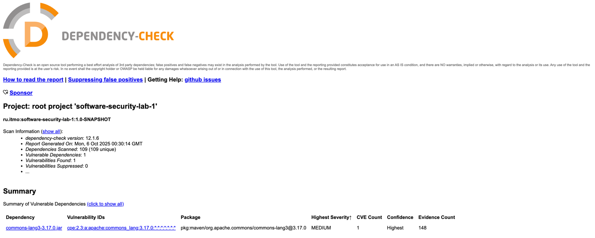

## Эндпоинты API

### Регистрация

#### POST http://localhost:8080/auth/sign-up
Content-Type: application/json
Accept: */*

```json
{
"login": "test",
"password": "123456",
"firstName": "Paul",
"surname": "Malkov"
}
```

### Аутентификация


#### POST http://localhost:8080/auth/login
Content-Type: application/json
Accept: */*

```json
{
"login": "test",
"password": "123456"
}
```

**Ответ:**
```json
{
  "token": "User created successfully",
  "expires_at": "timestamp"
}
```

### Защищенные эндпоинты (требуют JWT токен)

Создание нового поста

#### POST http://localhost:8080/posts/
Content-Type: application/json
Accept: */*
Authorization: Bearer {{jwt}}}

```json
{
"name": "Test2",
"subject": "Test subject",
"body": "Test body",
"ownerLogin": "test"
}
```

**Ответ:**
```json
{
  "posts": [
    {
      "ID": 5,
      "Author": "alice",
      "Title": "My New Post",
      "Content": "This is the post body.",
      "CreatedAt": "2025-09-16T13:20:07.385666Z"
    }
  ]
}
```

#### POST `/api/posts`
Создание нового поста.

**Заголовок:**
```
Authorization: Bearer <your_jwt_token>
```

**Тело запроса:**
```json
{
  "title": "My New Post",
  "content": "This is the post body."
}
```

**Ответ:**
```json
{
  "post": {
    "ID": 6,
    "Author": "alice",
    "Title": "My New Post",
    "Content": "This is the post body.",
    "CreatedAt": "2025-09-21T07:11:11.386164Z"
  }
}
```

#### GET `/api/posts`
Получение постов.

**Заголовок:**
```
Authorization: Bearer <your_jwt_token>
```

**Ответ:**
```json
{
  "post": {
    "ID": 6,
    "Author": "alice",
    "Title": "My New Post",
    "Content": "This is the post body.",
    "CreatedAt": "2025-09-21T07:11:11.386164Z"
  }
}
```

## Быстрый старт

### Установка и запуск

```bash
# Клонирование репозитория
git clone https://github.com/KASYM-TECH/is_lab1.git

docker compose up

go run .
```

## Меры защиты

### Защита от SQL-инъекций

**Реализация:** Использование параметризованных запросов через github.com/jmoiron/sqlx.

```go
	query := `INSERT INTO posts (author, title, content, created_at) VALUES ($1, $2, $3, NOW()) RETURNING id, author, title, content, created_at`
	var post model.Post
	if err := h.DB.Get(&post, query, login, body.Title, body.Content); err != nil {
		c.JSON(http.StatusInternalServerError, gin.H{"error": "failed to create post"})
		return
	}
```

### Защита от XSS атак

**Реализация:** Экранирование всех постов пользователей тегами `th:text` в шаблоне Thymeleaf.

### Защита аутентификации

**Хеширование паролей:** Использование "BCryptPasswordEncoder"
```java
	passwordEncoder.encode(signUpRequest.password())
```

**JWT токены:**
- Срок действия: 1 час
- Middleware проверки на всех защищенных эндпоинтах

## CI/CD Pipeline

### Запускаемые проверки

1) Login — POST http://localhost:8080/auth/sing-up
2) Create new post — POST http://localhost:8080/posts
3) Get posts HTML — POST http://localhost:8080/posts

## Отчеты безопасности

### OWASP Dependency-Check

-  (заключение)
